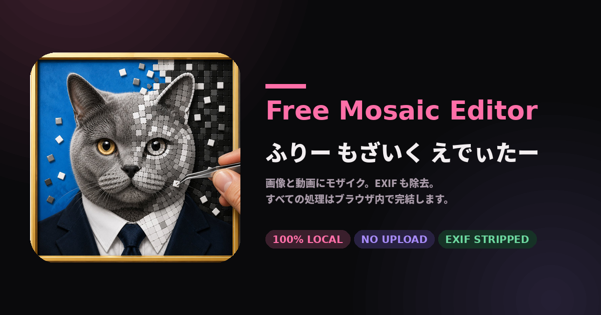

# ふりー もざいく えでぃたー

画像・動画にモザイクをかけて、メタデータ (EXIF/GPS/XMP/IPTC など) を完全除去するツールです。
**すべての処理がブラウザ内で完結し、ファイルは一切サーバーに送信されません。**

[](./)

## 特徴

- 完全クライアントサイド (静的ファイルのみ・PWA対応)
- 画像 & 動画: JPEG / PNG / WebP / GIF / MP4 / WebM / MOV
- 10種類のモザイク: ピクセル / ブラー / すりガラス / シャッフル / 網点 / 結晶化 / 渦巻き / ノイズ / 塗り / 絵文字
- 矩形 & 楕円形状、複数領域、領域ごとに独立した設定
- EXIF/メタデータ解析と書き出し時の完全除去
- スマートフォン対応 (safe-area-inset / タップ領域 44px+ / iOS自動ズーム防止)
- SEO完備 (Open Graph / Twitter Card / JSON-LD / sitemap.xml)

## 使い方

1. ファイルをドラッグ&ドロップ、または「ファイルを選ぶ」をタップ
2. キャンバス上をドラッグしてモザイク領域を追加
3. サイドバーでモザイクタイプとオプションを調整
4. 「メタデータ」タブで EXIF/GPS の有無を確認
5. 「書き出し」タブでフォーマットを選んでダウンロード

### キーボードショートカット

- `Del` / `Backspace`: 選択中の領域を削除
- `Esc`: 選択解除

## GitHub Pages にデプロイ

```bash
git init
git add .
git commit -m "Deploy"
git remote add origin https://github.com/<username>/<repo>.git
git push -u origin main
```

リポジトリ設定 → Pages → Source を `main` ブランチに設定。
`https://<username>.github.io/<repo>/` でアクセスできます。

### デプロイ後の推奨作業

OGP・canonical URL を絶対URLに置換すると SNS シェアでプレビューが表示されます:

```bash
sed -i 's|href="./"|href="https://yourname.github.io/redact/"|g' index.html
sed -i 's|content="\./|content="https://yourname.github.io/redact/|g' index.html
```

`.nojekyll` が含まれているので、`_shape.js` のようなアンダースコア始まりのファイルも問題なく配信されます。

## ファイル構成

```
.
├── index.html
├── manifest.webmanifest
├── robots.txt
├── sitemap.xml
├── .nojekyll
├── assets/        favicon各サイズ / apple-touch-icon / maskable / og-image
├── css/           (8) reset / tokens / layout / components / stage / panel / metadata / modal
└── js/
    ├── main.js
    ├── core/      (4) dom / events / state / utils
    ├── ui/        (8) tabs / dropzone / stage / pointer / regionList / toolbar / videoControls / modal
    ├── mosaic/    (12) index / _shape / _seed / pixelate / blur / frosted / scramble /
    │                    halftone / crystallize / swirl / noise / fill / emoji
    ├── metadata/  (8) index / tiff / jpeg / png / webp / tags / gps / render
    └── export/    (3) image / video / demo
```

## モザイク選択の指針

| タイプ | 復元耐性 | 備考 |
|---|---|---|
| 塗りつぶし | 完全 | 情報を完全に消したい時の第一候補 |
| 絵文字 | 完全 | 任意の絵文字で覆う |
| シャッフル | ほぼ完全 | タイル単位で順序を破壊 |
| 網点 | 高い | 新聞印刷風 |
| 結晶化 | 高い | Voronoi セル |
| すりガラス | 中 | 透明感を残しつつ識別不能に |
| 渦巻き | 低 | 中心から放射状に回転変位 |
| ノイズ | 中 | ピクセル + ランダムノイズ |
| ピクセル | 低 | 標準的なモザイク。AI で部分復元される可能性あり |
| ブラー | 低 | 自然なぼかし。AI で部分復元される可能性あり |

確実に隠したい個人情報には「塗りつぶし」「絵文字」「シャッフル」を推奨します。

## ブラウザ要件

- ES Modules 対応のモダンブラウザ (Chrome 89+, Firefox 89+, Safari 15+)
- 動画書き出しに `MediaRecorder` 対応が必要
- 動画形式は WebM (VP9/VP8) → MP4 H.264 の順で自動フォールバック

## ライセンス

MIT
